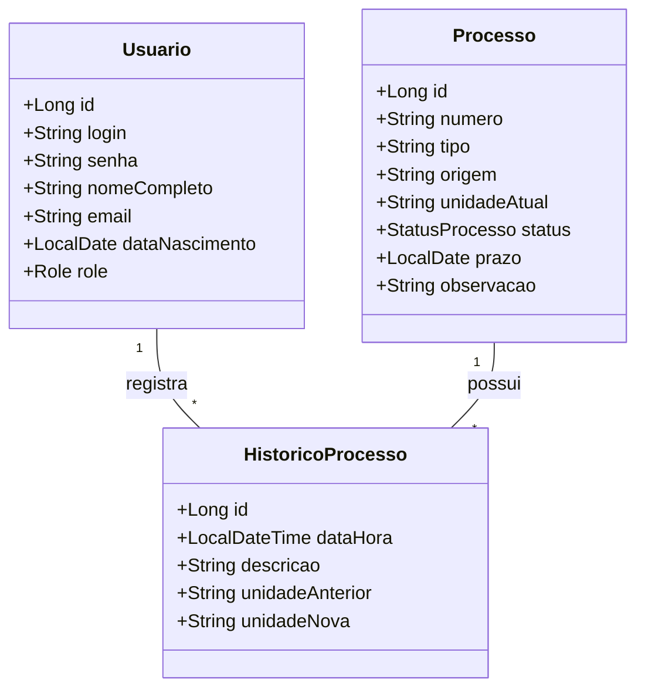
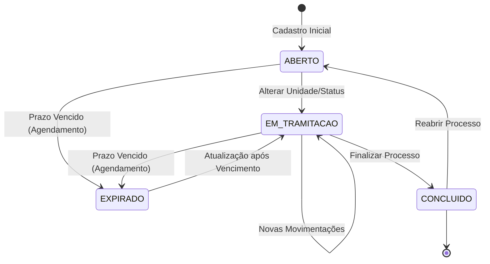
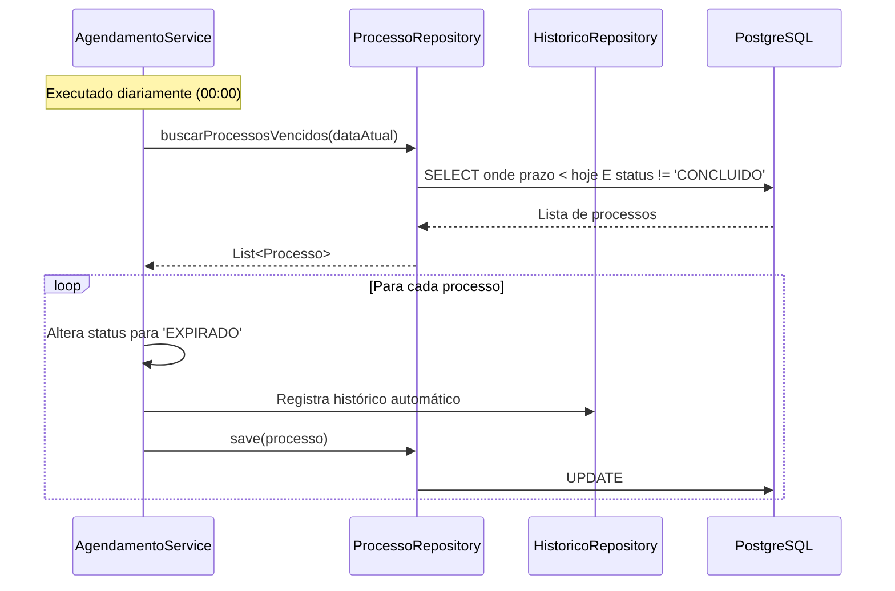

# 🏗️ Arquitetura e Design de Software - Gestão SEI

Este documento detalha as decisões arquiteturais, o modelo de dados e o fluxo de funcionamento do sistema Gestão SEI.

## 1. Visão Geral da Arquitetura

O sistema segue o padrão de arquitetura em camadas do **Spring Boot**, garantindo a separação de responsabilidades e facilitando a manutenção e testes.

- **Controller**: Exposição dos endpoints REST e tratamento de requisições.
- **Service**: Concentração das regras de negócio (validações, cálculos de prazo, agendamentos).
- **Repository**: Interface de comunicação com o banco de dados PostgreSQL via Spring Data JPA.
- **Model/Entity**: Representação das tabelas do banco de dados e seus relacionamentos.
- **DTO (Data Transfer Object)**: Segurança na trafegação de dados, evitando a exposição direta das entidades.

## 2. Diagramas UML

### A. Diagrama de Classe (Modelo de Dados)
O diagrama abaixo representa a estrutura das entidades e como elas se relacionam para manter a integridade do histórico.

### B. Ciclo de Vida do Processo (Estados)
O sistema gerencia automaticamente os estados dos processos com base na interação do usuário e no passar do tempo.

### C. Fluxo de Agendamento Automático
O sistema possui um serviço de agendamento (`@Scheduled`) que executa diariamente à meia-noite para garantir a atualização dos prazos.

## 3. Regras de Negócio (RN)

| ID | Regra de Negócio | Descrição |
|:---:|:--- |:--- |
| **RN01** | **Integridade de Usuário** | Não é permitida a exclusão de usuários que possuam registros vinculados no histórico de processos. |
| **RN02** | **Auditoria Obrigatória** | Toda alteração de 'Unidade Atual' ou 'Status' deve gerar automaticamente um registro no Histórico com o usuário logado. |
| **RN03** | **Alerta de Urgência** | Processos com prazo <= 5 dias são sinalizados como urgentes no sistema. |
| **RN04** | **Segurança Administrativa** | Apenas perfis `ADMIN` podem gerenciar usuários e redefinir senhas de terceiros. |
| **RN05** | **Troca de Senha Própria** | Usuários `USER` devem informar a senha atual para definir uma nova. |

## 4. Tecnologias Utilizadas

- **Java 21**: Uso de Records e novas APIs de data/hora.
- **Spring Boot 3.4**: Segurança com JWT e persistência com JPA.
- **JasperReports**: Motor de geração de relatórios complexos em PDF.
- **Docker**: Conteinerização para padronização de ambientes de desenvolvimento e produção.
