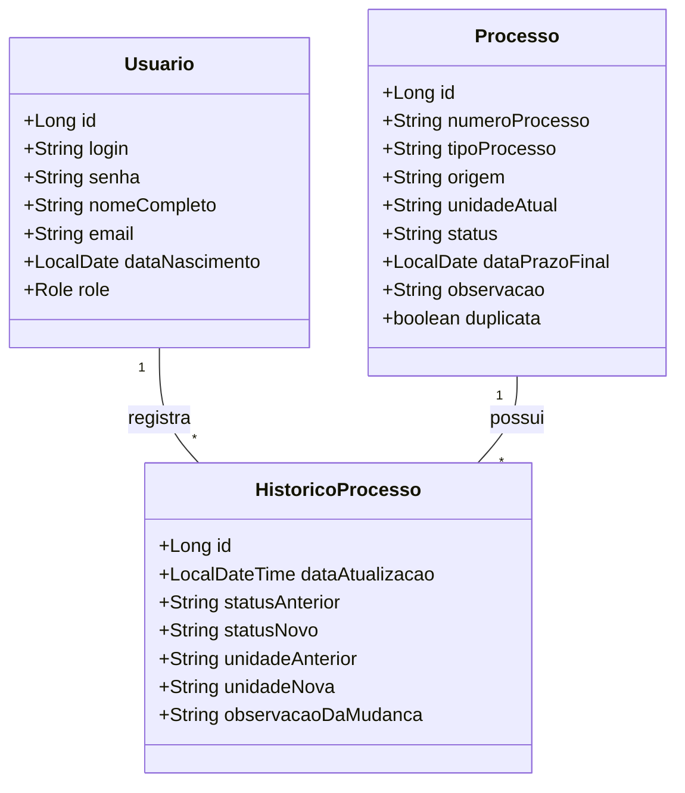
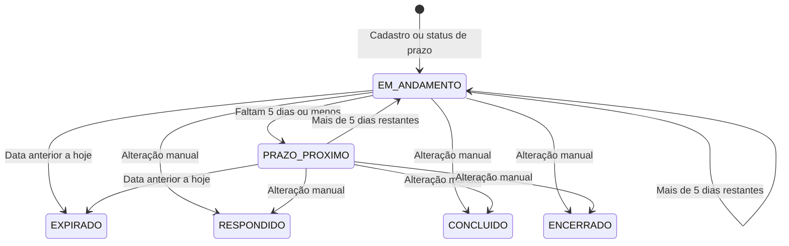
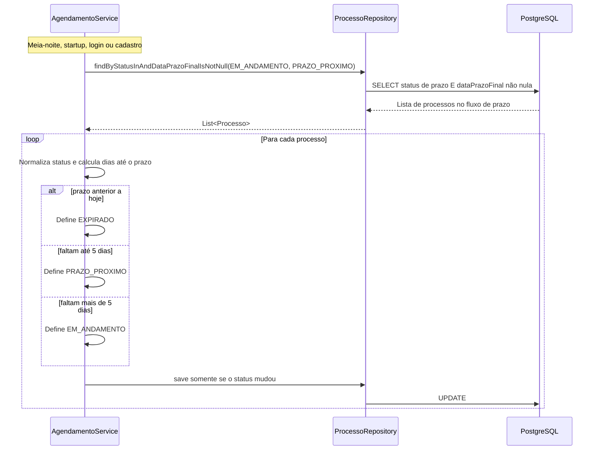

# 🏗️ Arquitetura e Design de Software - Gestão SEI

Este documento detalha as decisões arquiteturais, o modelo de dados e o fluxo de funcionamento do sistema Gestão SEI.

## 1. Visão Geral da Arquitetura

O sistema segue o padrão de arquitetura em camadas do **Spring Boot**, garantindo a separação de responsabilidades e facilitando a manutenção e testes.

- **Controller**: Exposição dos endpoints REST e tratamento de requisições.
- **Service**: Concentração das regras de negócio (validações, cálculos de prazo, agendamentos).
- **Repository**: Interface de comunicação com o banco de dados PostgreSQL via Spring Data JPA.
- **Model/Entity**: Representação das tabelas do banco de dados e seus relacionamentos.
- **DTO (Data Transfer Object)**: Segurança na trafegação de dados, evitando a exposição direta das entidades.

## 2. Diagramas UML

### A. Diagrama de Classe (Modelo de Dados)

O diagrama abaixo representa a estrutura das entidades e como elas se relacionam para manter a integridade do histórico.

```mermaid
classDiagram
    class Usuario {
        +Long id
        +String login
        +String senha
        +String nomeCompleto
        +String email
        +LocalDate dataNascimento
        +Role role
    }

    class Processo {
        +Long id
        +String numeroProcesso
        +String tipoProcesso
        +String origem
        +String unidadeAtual
        +String status
        +LocalDate dataPrazoFinal
        +String observacao
        +boolean duplicata
    }

    class HistoricoProcesso {
        +Long id
        +LocalDateTime dataAtualizacao
        +String statusAnterior
        +String statusNovo
        +String unidadeAnterior
        +String unidadeNova
        +String observacaoDaMudanca
    }

    Usuario "1" -- "*" HistoricoProcesso : registra
    Processo "1" -- "*" HistoricoProcesso : possui
```

### B. Ciclo de Vida do Processo (Estados)

O status é armazenado como texto e utiliza os valores padronizados definidos em `StatusProcesso`. O fluxo automático atua somente sobre os status de prazo (`Em andamento` e `Prazo próximo`). Status finais não são recalculados automaticamente.

```mermaid
stateDiagram-v2
    [*] --> EM_ANDAMENTO: Cadastro ou status de prazo
    EM_ANDAMENTO --> PRAZO_PROXIMO: Faltam 5 dias ou menos
    EM_ANDAMENTO --> EXPIRADO: Data anterior a hoje
    PRAZO_PROXIMO --> EXPIRADO: Data anterior a hoje
    PRAZO_PROXIMO --> EM_ANDAMENTO: Mais de 5 dias restantes
    EM_ANDAMENTO --> EM_ANDAMENTO: Mais de 5 dias restantes
    EM_ANDAMENTO --> RESPONDIDO: Alteração manual
    EM_ANDAMENTO --> CONCLUIDO: Alteração manual
    EM_ANDAMENTO --> ENCERRADO: Alteração manual
    PRAZO_PROXIMO --> RESPONDIDO: Alteração manual
    PRAZO_PROXIMO --> CONCLUIDO: Alteração manual
    PRAZO_PROXIMO --> ENCERRADO: Alteração manual
```

### C. Fluxo de Agendamento Automático

O `AgendamentoService` executa a mesma rotina de recálculo em quatro situações: agendamento diário à meia-noite, inicialização da aplicação, login autenticado e cadastro de processo. Ao alterar a data de prazo de um processo, o status também é recalculado no fluxo de atualização.

```mermaid
sequenceDiagram
    participant S as AgendamentoService
    participant R as ProcessoRepository
    participant DB as PostgreSQL

    Note over S: Meia-noite, startup, login ou cadastro
    S->>R: findByStatusInAndDataPrazoFinalIsNotNull(EM_ANDAMENTO, PRAZO_PROXIMO)
    R->>DB: SELECT status de prazo E dataPrazoFinal não nula
    DB-->>R: Lista de processos no fluxo de prazo
    R-->>S: List<Processo>
    
    loop Para cada processo
        S->>S: Normaliza status e calcula dias até o prazo
        alt prazo anterior a hoje
            S->>S: Define EXPIRADO
        else faltam até 5 dias
            S->>S: Define PRAZO_PROXIMO
        else faltam mais de 5 dias
            S->>S: Define EM_ANDAMENTO
        end
        S->>R: save somente se o status mudou
        R->>DB: UPDATE
    end
```

O job automático não cria registros em `HistoricoProcesso`; o histórico é registrado no fluxo de atualização manual quando há alteração de status ou unidade com usuário autenticado.

## 3. Regras de Negócio (RN)

| ID | Regra de Negócio | Descrição |
| :---: | :--- | :--- |
| **RN01** | **Integridade de Usuário** | Não é permitida a exclusão de usuários que possuam registros vinculados no histórico de processos. |
| **RN02** | **Auditoria Obrigatória** | Toda alteração de 'Unidade Atual' ou 'Status' deve gerar automaticamente um registro no Histórico com o usuário logado. |
| **RN03** | **Fluxo de Prazos** | Processos com status de prazo e data final não nula são recalculados: `PRAZO_PROXIMO` quando faltam até 5 dias, `EXPIRADO` quando a data passou e `EM_ANDAMENTO` nos demais casos. |
| **RN04** | **Segurança Administrativa** | Apenas perfis `ADMIN` podem gerenciar usuários e redefinir senhas de terceiros. |
| **RN05** | **Troca de Senha Própria** | Usuários `USER` devem informar a senha atual para definir uma nova. |

## 4. Tecnologias Utilizadas

- **Java 21**: Uso de Records e novas APIs de data/hora.
- **Spring Boot 3.5.13**: Segurança com JWT e persistência com JPA.
- **JasperReports**: Motor de geração de relatórios complexos em PDF.
- **Docker**: Conteinerização para padronização de ambientes de desenvolvimento e produção.
