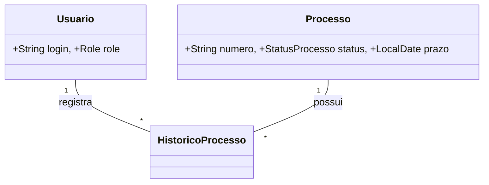

# 📋 Gestão SEI Backend

[](https://openjdk.org/)
[](https://spring.io/projects/spring-boot)
[](https://www.postgresql.org/)
[](https://www.docker.com/)
[](src/test)
[](LICENSE)

> 🚀 Sistema de backend para controle de prazos e tramitação de processos do SEI, desenvolvido especialmente para servidores públicos.

## 📋 Sobre o Projeto

O **Gestão SEI Backend** é uma solução robusta para gerenciar o fluxo de processos administrativos do sistema SEI. Ele permite o acompanhamento de prazos, registro automático de histórico de tramitação e geração de relatórios gerenciais em PDF.

> 💡 **Este repositório é um template.** A organização [GestaoSEI](https://github.com/GestaoSEI) foi criada para que outros servidores públicos possam utilizar este sistema como ponto de partida, adaptando-o à realidade de sua própria unidade. Sinta-se à vontade para fazer um fork e personalizar.

## 🛠️ Arquitetura e Design

O projeto utiliza uma arquitetura baseada em camadas e segue padrões modernos de desenvolvimento. Para detalhes sobre o modelo de dados, ciclo de vida de processos e diagramas de sequência, acesse:

👉 **[Documentação de Arquitetura (Diagramas UML)](ARQUITETURA.md)**

### Modelo de Dados Resumido


## ✨ Funcionalidades e Regras de Negócio

| ID | Regra | Descrição |
| :---: | :--- | :--- |
| **RN01** | **Integridade** | Bloqueia exclusão de usuários com histórico de tramitação. |
| **RN02** | **Auditoria** | Registro automático no histórico para cada mudança de status/unidade. |
| **RN03** | **Prazos** | Sinalização de urgência (<= 5 dias) e expiração automática (Cron Job). |
| **RN04** | **Perfis** | Controle de acesso granular entre `ADMIN` e `USER`. |

### 🔐 **Segurança e Acesso**
- Autenticação via **JWT**.
- Login, reset de senha e troca de senha com validação de perfil.

### 📊 **Gestão de Processos**
- Cadastro, busca simplificada por termo único e filtros avançados.
- **Agendamento Automático:** Verificação diária à meia-noite para processos vencidos.
- **Importação e exportação CSV:** carga de processos por arquivo CSV e exportação completa dos registros cadastrados.

### 📈 **Relatórios Gerenciais**
- Exportação em PDF via **JasperReports** com filtros dinâmicos e formatação PT-BR.

## 🏗️ Estrutura de Pastas
```text
src/main/java/br/gov/gestaosei/gestao_sei_backend/
├── 📁 config/          # Segurança (JWT), OpenAPI e Filtros
├── 📁 controller/      # API Endpoints
├── 📁 model/           # Entidades JPA
├── 📁 service/         # Regras de Negócio e Agendamentos (Cron)
└── 📁 repository/      # Acesso ao Banco de Dados
```

## 🚀 Como Executar (Docker)

**Pré-requisitos:** Docker e Docker Compose.

1. **Subir a aplicação:**
   ```bash
   docker-compose up --build -d
   ```
2. **Swagger UI:** [http://localhost:8081/swagger-ui.html](http://localhost:8081/swagger-ui.html)
3. **Credenciais Iniciais:** `admin` / `admin123`

## 🚀 Como Executar Localmente

Se preferir rodar fora do Docker, suba apenas o banco com:

```bash
docker-compose up db -d
```

O PostgreSQL ficará disponível em `localhost:5433` com o banco `gestaosei`, usuário `postgres` e senha `postgres`.

Depois, inicie a aplicação com:

```bash
./mvnw spring-boot:run
```

Se precisar apontar para outro banco, sobrescreva as variáveis `SPRING_DATASOURCE_URL`, `SPRING_DATASOURCE_USERNAME` e `SPRING_DATASOURCE_PASSWORD`.

## 🧪 Testes
O projeto conta com **22 testes unitários**.
```bash
./mvnw test
```

## 💾 Backup Local
Scripts PowerShell em `scripts/` para backups e exportação rápida dos dados:
- `.\scripts\snapshot-dados.ps1` (snapshot completo: backup SQL + exportação de processos + histórico)
- `.\scripts\backup-bd.ps1` (dump do banco PostgreSQL)
- `.\scripts\exportar-processos.ps1` (CSV dos processos)
- `.\scripts\exportar-historico.ps1` (CSV do histórico de tramitação)

### Exportação via API
O backend também disponibiliza exportação direta dos processos cadastrados em CSV:

- `GET /api/processos/exportar-csv`
- Retorno: arquivo `processos.csv`
- Colunas exportadas: `numeroProcesso`, `tipoProcesso`, `origem`, `unidadeAtual`, `status`, `dataPrazoFinal`, `observacao`
- Valores com vírgula, aspas ou quebra de linha são escapados automaticamente

---
Made with ❤️ by Gilvaneide Medeiros
